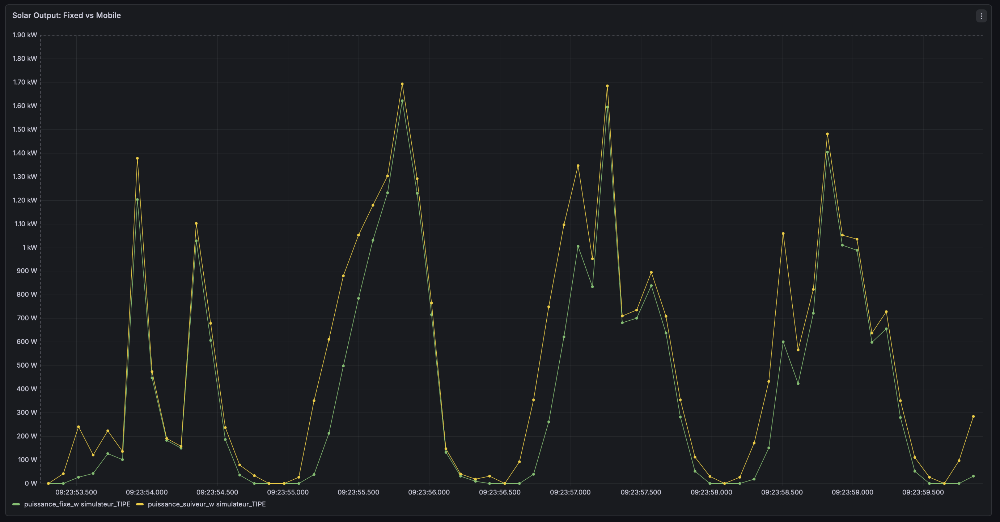

# Sun-Chaser-IoT

## The Story: Why We Built This?
In two years of preparatory class, I spent a lot of time and energy into my TIPE project: optimizing the orientation of solar panels to maximize energy capture.

When I entered engineering school, I faced a choice. I could put all that hard work into a drawer and start something new, or I could take what I already built and make it better. 

I believed that my previous work mattered. Using the new software and green tech skills learned during my first year of engineering studies, I decided to upgrade mu physical prototype into a real, working IoT system.

## What This Project Does
This repository takes the raw energy data from my TIPE project (comparing a fixed solar panel against a mobile tracking panel) and turns it into a live monitoring pipeline. 

Instead of static Excel sheets, this system handles the complete data flow for a **Smart Grid** application:
- **Core Logic:** Uses Python (`publisher.py`) to stream the sun-tracking calculations, power output (in Watts), and irradiance metrics.
- **Data Transmission:** Relies on an MQTT broker (Mosquitto) for fast messaging.
- **Time-Series Storage:** Ingests and saves every data point into **InfluxDB** (`subscriber.py`).
- **Client-Ready Visualization:** Display the data on a **Grafana** dashboard to clearly demonstrate performance gains (such as our TIPE's proven energy increase) for future smart grid integration.

## 📊 Dashboard & Technical Note on Performance

Here is what the live supervision interface looks like in action:

### ⚠️ A Note on the Energy Gain (16.0% vs 19.85%)
If you look closely at the dashboard, you will notice an energy gain of **16.0%**, whereas my  TIPE research over the full year of 2024 in Mulhouse in France proved a gain of **19.85%**. 

**Why the difference?**
- **The TIPE Baseline:** my original model processed hourly real-world solar outputs and irradiance data  across an entire year (hour by hour, day by day).
- **The IoT Simulation:** To test and demonstrate the pipeline efficiently without waiting 365 days, the entire year's worth of Excel data is streamed through MQTT in just 5 to 6 minutes, with a 0.1-second interval between data points. 

Because we fast-forwarded a whole year of data into just a few minutes, the final result is slightly different (**16.0%** instead of **19.85%**). But if we connect this system to real solar panels in real life, it is totally ready to track and show the data live.

## 📂 Repository Structure
.
├── docker-compose.yml       # Launches Mosquitto, InfluxDB, and Grafana containers
├── mosquitto.conf           # MQTT broker settings
├── publisher.py             # Streams the solar power and tracking data
├── subscriber.py            # Ingests MQTT data and writes it directly to InfluxDB
├── grafana_dashboard.json   # Exported dashboard template for instant visualization
└── README.md                # Project documentation

